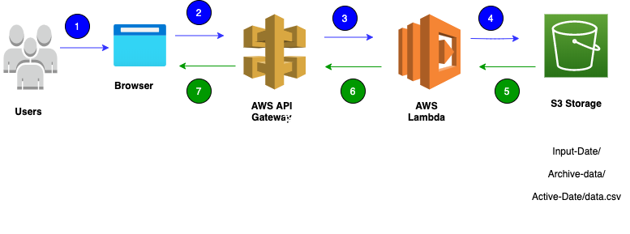

# A Terraform AWS DevOPS Project


### Project Objective

This application will use several AWS services to store and retrieve data from a file.  An ***S3*** bucket will store the file, **S3 Select*** retrieves data from the file, ***Lambda functions*** for the processing and workflow of the data, and ***API Gateway*** for user interaction. Terraform (www.terraform.io) is used to deploy all AWS resources as IaC (Infrastructure as Code).


### Prerequisites

* Terraform installed on the work station.
    - [Install Terraform](https://learn.hashicorp.com/tutorials/terraform/install-cli)
* AWS Free account.
    - [Create a Free AWS Accout](https://aws.amazon.com/free/)


### Application Workflow
<br>



1. Users access the AWS API gateway using a web browser.
2. The API gateway performs the request, either GET or POST, to the AWS Lambda function. 
3. The Lambda function(s) calls the event handler and acts on the data file stored in the S3 bucket.
4. The Lambda function returns the results to the API gateway.
5. The API renders the results to the user's browser. 


### AWS S3 Storage

This project will use ***S3*** storage to store the active data file and archive uploaded data files. ***S3 Select*** will be used to retrieve, update, and archive the data. The following is the ***S3*** bucket layout for this project.


**Active data location:**

    <bucket>/Active-Data/data.csv

**Upload data location:**
    
    <bucket>/Input-Data/<file-name>-<upload-date>.csv

**Archive data location:**
    
    <bucket>/Archive-Data/<file-name>-<upload-date>.csv


### Data File Format

Input data will be CSV format, and an example is as follows.

```
"Type","Rate","Date"
"car","0.5","2021-04-20"
"house-30","0.24","2021-04-20"
"house-15","0.14","2021-04-20"
"discover-cc","0.6","2021-04-21"
"master card","0.6","2021-04-21"

```

### AWS Lambda Functions

The following AWS Lambda functions upload, process, and retrieve the data.


* **src/data-query-function/lambda_function.py**
<br>
    >The ***data-query-function*** python code performs a S3 select and returns based on query parameters received as an event.

* **src/s3-trigger-function/lambda_function.py**  
<br>
    >The ***s3-trigger-function*** python code is an S3 trigger that appends the uploaded file to the active data.csv file and then copies the file to the Archive-Data/ path appending a current timestamp.


* **src/upload-file-function/lambda_funciton.py**  
<br>
    >The ***upload-file-function*** python code places the uploaded data file in the Input-Data/ path for processing.


### AWS API Gateway


### Deploying AWS Resources with Terraform

##### How do you initialize project?

Within a new project folder, execute the following command.

` $ terraform init `

##### How do you verify the Terraform project before deploying?

Within the project folder, execute the following command.

` $ terraform validate `

##### How do you deploy the project?

Within the project folder, execute the following command.

` $ terraform apply `

### Project TODO List

* 04/25/2021: Configure and test API Gateway resources for Lambda functions.
* 04/25/2021: Enhance ***s3-trigger-function*** to append the uploaded CSV data to the ***Active-Data/data.csv*** file.
* 04/25/2021: Further testing of the ***s3-trigger-function*** after the upload function.
* 04/25/2021: Build UML diagrams for each of the Lambda functions.
* 04/25/2021: Terraform Configuration: Add Cloud Watch resources for all other resources.

### Project References

Following are some documentation referrences that assisted with the project objectives.

* AWS
    - [S3 Select]( https://docs.aws.amazon.com/AmazonS3/latest/userguide/s3-glacier-select-sql-reference-select.html)
    - [S3 Select Examples](https://aws.amazon.com/blogs/storage/querying-data-without-servers-or-databases-using-amazon-s3-select/)
    - [AWS Identity and Access Management Documentation](https://docs.aws.amazon.com/iam/index.html)
    - [Amazon API Gateway](https://aws.amazon.com/api-gateway/)
    - [Tutorial: Using an Amazon S3 trigger to invoke a Lambda function](https://docs.aws.amazon.com/lambda/latest/dg/with-s3-example.html)

* Python
    - [Building Lambda functions with Python](https://docs.aws.amazon.com/lambda/latest/dg/lambda-python.html)
    - [boto3 docs](https://boto3.amazonaws.com/v1/documentation/api/latest/index.html)
* Terraform
    - [Introduction to Infrastructure as Code with Terraform](https://learn.hashicorp.com/tutorials/terraform/infrastructure-as-code?in=terraform/aws-get-started)
    - [Files and Directories](https://www.terraform.io/docs/language/files/index.html)
    - [Standard Module Structure](https://www.terraform.io/docs/language/modules/develop/structure.html)
    - [Terraform Examples from Github](https://github.com/futurice/terraform-examples)
